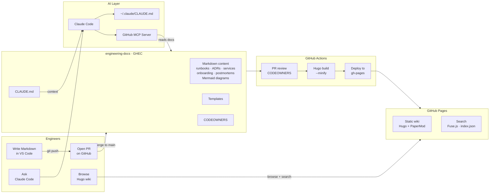
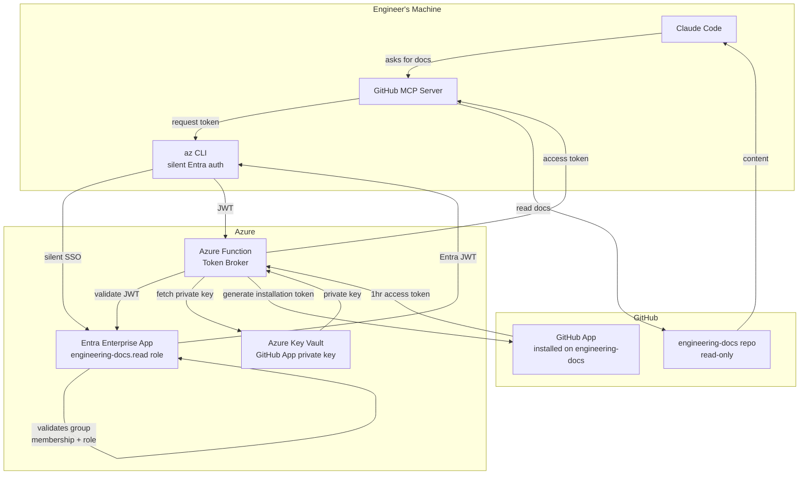

| | |
|---|---|
| **Status** | Proposed |
| **Date** | April 2026 |
| **Author** | Rich — VP Engineering |
| **Reviewers** | Platform Engineering Team |

---

## Context

Our current engineering knowledge is fragmented and unreliable. Documentation is spread
across the DevOps Wiki, individual Coda pages, and informal Microsoft Teams threads —
with no single source of truth. Content is frequently stale, inconsistently formatted, and
hard to discover. Engineers waste time searching multiple systems for runbooks, architecture
decisions, and onboarding guides, and cannot trust that what they find is current.

There is no enforced structure around critical operational knowledge. Runbooks exist in
different formats across multiple systems. Architecture decisions are written down but live
in Microsoft Loop, which is disconnected from our engineering workflows and not easily
searchable by humans or AI tooling. Service-level knowledge — architecture, dependencies,
operational runbooks — is scattered across service repositories, wikis, and individuals,
with no consistent structure or single place to query. New joiners in particular struggle,
as onboarding material is scattered and out of date.

The current state also means Claude Code — and AI tooling more broadly — has no reliable
knowledge base to reference. Without a canonical, machine-readable docs store, AI-assisted
workflows have nothing authoritative to draw from. An AI asked about a service, an ADR, or
an operational procedure must either guess or ask the engineer — it cannot look it up.

## Decision

We will establish a docs-as-code platform built on four integrated components:

**1. Canonical Docs Repository (GHEC)**
A dedicated GitHub repository (`company-name/engineering-docs`) in GitHub Enterprise Cloud
becomes the single source of truth for all engineering knowledge. All documentation is
written in Markdown and lives under version control. The repository is structured around
five content areas: runbooks, architecture decision records (ADRs), onboarding guides,
postmortems, and service documentation. Templates are provided for each type and enforced
via CODEOWNERS and PR review.

Service documentation — including architecture overviews, dependency maps, owner
information, SLOs, and service-specific runbooks — lives in `content/services/<service>/`
within this repository, not in individual service repositories. This ensures all service
knowledge is co-located, searchable, and accessible to both humans and AI in one place.

Service repositories retain only lightweight, locally-relevant documentation in their
`CLAUDE.md`: how to run the service locally, how to run tests, and build commands.
Everything substantive about a service belongs in engineering-docs.

**2. Static Site Wiki (Hugo + GitHub Pages)**
A Hugo-based static site renders the Markdown repository as a browsable internal wiki,
deployed automatically to GitHub Pages via GitHub Actions on every merge to `main`. This
gives the team a clean, searchable, human-readable interface to the docs without requiring
Git knowledge to read them. Service pages, ADRs, runbooks, and onboarding guides are all
discoverable from a single site.

**3. CLAUDE.md Instruction Layer**
A standard `~/.claude/CLAUDE.md` is distributed to each engineer via the onboarding
process and dotfiles, establishing context about the docs platform — where docs live, what
document types exist, which templates to use, and how to interact with the canonical store.
This applies globally across all repos without requiring per-repo configuration.

Service repositories contain a minimal `CLAUDE.md` covering only local setup and test
commands, with a pointer to their service page in engineering-docs for all other context.

**5. Diagramming (Mermaid)**
Architecture diagrams, flow diagrams, and dependency maps are written as Mermaid code
blocks directly in Markdown. Hugo renders them as interactive SVG diagrams in the browser
via a render hook and the Mermaid JS library — no external diagramming tool, no image
files to maintain, and no broken diagrams when services change.

Diagrams live alongside the documentation they describe. A service architecture diagram
lives in `content/services/<service>/_index.md`. A platform overview lives in the
relevant ADR. Because diagrams are code, they go through the same PR review process as
all other documentation changes.

Mermaid supports flowcharts, sequence diagrams, entity-relationship diagrams, Gantt
charts, and more. For the majority of engineering documentation needs — service
architecture, deployment flows, incident timelines, data models — Mermaid covers the
requirement without requiring engineers to context-switch into a separate tool.

**Diagram interaction**
Complex architecture diagrams present a readability challenge when rendered at page width
— particularly multi-service or platform-level diagrams with many nodes and connections.
To address this, diagrams in the Hugo site are rendered with pan and zoom interaction via
the `svg-pan-zoom` library. Engineers can scroll to zoom into any part of a diagram and
drag to pan, without leaving the page. Lightweight custom controls (zoom in, zoom out,
reset) are overlaid in the bottom-right corner of each diagram.

This is implemented via a Hugo render hook (`layouts/_default/_markup/render-codeblock-mermaid.html`)
that wraps each Mermaid code block in a fixed-height container, and a head partial
(`layouts/partials/extend_head.html`) that initialises Mermaid and attaches pan-zoom
behaviour to each rendered SVG via a `MutationObserver`. The Mermaid JS and svg-pan-zoom
library are loaded only on pages that contain diagrams.

Where richer or more complex diagrams are needed (e.g. existing Miro boards), SVG or PNG
exports can be placed in `static/images/` and referenced from any page. Mermaid is the
default; static exports are the fallback.

**4. MCP Integration (GitHub MCP Server)**
Anthropic's GitHub MCP server is configured to give Claude Code programmatic access to
`engineering-docs`. This enables Claude to search, read, and propose changes to
documentation directly from within any engineering workflow — finding existing runbooks
before generating new ones, reading ADRs for architectural context, reading service
documentation when working within a service repo, and raising PRs when new documentation
is needed. Because all service knowledge lives in engineering-docs, a single MCP
configuration gives Claude access to the full picture.

**Repository structure:**

```
engineering-docs/
├── CLAUDE.md
├── content/
│   ├── runbooks/
│   ├── adr/
│   ├── onboarding/
│   ├── postmortems/
│   ├── standards/
│   └── services/
│       ├── <service-name>/
│       │   ├── _index.md        ← overview, architecture, owners, SLOs
│       │   ├── runbook-*.md     ← service-specific runbooks
│       │   └── adr-*.md         ← service-scoped decisions (if applicable)
│       └── ...
├── templates/
│   ├── runbook-template.md
│   ├── adr-template.md
│   ├── postmortem-template.md
│   └── service-template.md
├── hugo.toml
├── layouts/
│   ├── _default/_markup/
│   │   └── render-codeblock-mermaid.html  ← Mermaid render hook
│   └── partials/
│       └── extend_head.html               ← loads Mermaid JS conditionally
└── .github/
    └── workflows/
        └── deploy.yml
```

## Claude Code modes: /docs and /work

To make it easy for engineers to switch between querying documentation and working on a
service, two Claude Code slash commands are provided: `/docs` and `/work`. These are
available in any service repo and are designed so that all prompt behaviour is managed
centrally from `engineering-docs` — no service repo changes are needed when the prompts
are updated.

### The two modes

**`/docs` — Documentation mode**
Instructs Claude to answer exclusively from `engineering-docs` via the GitHub MCP server.
Claude will not use local repo files, training knowledge, or the web. If the answer is
not in engineering-docs, it will say so rather than guessing. Use this when looking up
runbooks, ADRs, service pages, or platform standards.

**`/work` — Work mode**
Returns Claude to normal engineering mode. Local repo files, training knowledge, and all
available tools are in scope. The engineering-docs repo remains available via MCP for
reference. Use this when writing code, debugging, or working on tasks within the service
repo.

Each mode confirms activation and tells the engineer how to switch to the other. Use
`/clear` to wipe context entirely and start fresh.

### Centralised prompt architecture

The prompt instructions for each mode live in `engineering-docs`, not in individual
service repos:

```
engineering-docs/
└── .claude/
    └── prompts/
        ├── docs-mode.md    ← prompt for /docs
        └── work-mode.md    ← prompt for /work
```

Service repos contain only two thin command files — pointers that instruct Claude to
fetch the prompt from `engineering-docs` via MCP at invocation time:

```
your-service-repo/
└── .claude/
    └── commands/
        ├── docs.md    ← one line: fetch docs-mode.md from engineering-docs
        └── work.md    ← one line: fetch work-mode.md from engineering-docs
```

The content of each command file is a single instruction:

**`.claude/commands/docs.md`**
```
Using the GitHub MCP server, read the file `.claude/prompts/docs-mode.md`
from the rawsharklives/engineering-docs repository and follow the instructions
in it exactly.
```

**`.claude/commands/work.md`**
```
Using the GitHub MCP server, read the file `.claude/prompts/work-mode.md`
from the rawsharklives/engineering-docs repository and follow the instructions
in it exactly.
```

When the prompt behaviour needs updating — tightening mode restrictions, changing the
confirmation message, pointing at a renamed repo — update the prompt files in
`engineering-docs` once. Every service repo picks up the change immediately on next
invocation. No PRs required in individual repos.

### Adding /docs and /work to a new service repo

Four steps, takes under two minutes:

**1. Create the commands directory**
```bash
mkdir -p .claude/commands
```

**2. Create `.claude/commands/docs.md`**
```
Using the GitHub MCP server, read the file `.claude/prompts/docs-mode.md`
from the rawsharklives/engineering-docs repository and follow the instructions
in it exactly.
```

**3. Create `.claude/commands/work.md`**
```
Using the GitHub MCP server, read the file `.claude/prompts/work-mode.md`
from the rawsharklives/engineering-docs repository and follow the instructions
in it exactly.
```

**4. Commit and push**
```bash
git add .claude/commands/
git commit -m "Add /docs and /work Claude Code mode commands"
git push
```

The commands are immediately available in any Claude Code session opened in that repo.

### Verification

Open a Claude Code session in the repo and run `/docs`. Claude should fetch
`docs-mode.md` from engineering-docs via MCP, confirm it is in Docs Mode, and tell the
engineer to type `/work` to switch back. If it fails, check the MCP server is connected:

```bash
claude mcp list
```

### File reference

| File | Location | Purpose |
|------|----------|---------|
| Docs mode prompt | `engineering-docs/.claude/prompts/docs-mode.md` | Central prompt for /docs |
| Work mode prompt | `engineering-docs/.claude/prompts/work-mode.md` | Central prompt for /work |
| Service command (docs) | `<service-repo>/.claude/commands/docs.md` | Pointer to docs-mode.md |
| Service command (work) | `<service-repo>/.claude/commands/work.md` | Pointer to work-mode.md |

---

## Platform overview



## Consequences

### Positive

- **Single source of truth.** All engineering documentation — including service knowledge
  previously scattered across repos, Loop, and Coda — lives in one place, under version
  control, with a clear structure and enforced templates.
- **Documentation as a first-class engineering practice.** Docs go through the same
  review process as software — PRs, CODEOWNERS approval, and a clear audit trail.
- **Improved discoverability.** The Hugo wiki gives the whole team a fast, searchable,
  always-current interface to operational knowledge, services, and decisions in one place.
- **AI-ready knowledge base.** The MCP integration means Claude Code can answer questions
  about any service, find runbooks, and read ADRs from a single configured source — in any
  engineering workflow, without the engineer needing to provide context manually.
- **Low operational overhead.** No new infrastructure. GitHub Enterprise Cloud, GitHub
  Actions, and GitHub Pages are tools we already have.
- **Portability and longevity.** Plain Markdown in Git is readable by any tool, any
  editor, and any future platform.
- **Diagrams as code.** Mermaid diagrams live in the same repo as the documentation they
  describe, go through PR review, and render automatically on the Hugo site. No external
  diagramming tool or stale image exports to maintain.

### Negative

- **Adoption requires discipline.** The value is entirely dependent on consistent use.
  Without team buy-in, the repo risks becoming another stale documentation graveyard. This
  is a process change, not just a tooling change.
- **Service docs must be kept in sync with service repos.** Engineers making significant
  changes to a service are responsible for updating the corresponding service page in
  engineering-docs. This needs to be part of the definition of done.
- **Git as the contribution interface.** Non-engineering stakeholders will need guidance
  or a lightweight editor workflow.
- **Initial migration effort.** Existing useful content in the DevOps Wiki, Microsoft Loop,
  and Coda needs to be reviewed, updated, and migrated. This is a one-time cost but
  requires dedicated time to do properly.
- **MCP is relatively new tooling.** The GitHub MCP server integration requires
  familiarity and per-engineer configuration overhead.
- **Hugo theme maintenance.** Significant customisation would become an asset to maintain.
  Keeping it minimal reduces this risk.

### Follow-on work

- Configure GitHub MCP server for each engineer's Claude Code environment
- Distribute standard `~/.claude/CLAUDE.md` via onboarding and dotfiles
- Migrate high-value content from DevOps Wiki, Microsoft Loop, and Coda
- Add service pages for each existing service as part of the migration
- Add a service `_index.md` template to the templates directory
- Define a process for keeping service docs current (ownership, review cadence)
- Update each service repo's `CLAUDE.md` to be lightweight and point to engineering-docs
- Evaluate onboarding editor tooling for non-Git contributors
- Add Mermaid diagrams to service pages as they are created or migrated

---

## Access control

The Hugo site is deployed to GitHub Pages and must be accessible only to [company-name]
engineers — not the public internet.

### On GitHub Enterprise Cloud (production)

GHEC supports private GitHub Pages natively. Access is restricted to authenticated
members of the GitHub organisation via a single setting:

**Settings → Pages → Access control → Private**

With this enabled, any engineer who is not an authenticated member of the
`company-name` GitHub organisation will receive a 404 when attempting to access the site.
No changes to the Hugo build, the Actions workflow, or the repository structure are
required. This is the mechanism that will be used when the platform is deployed to GHEC.

### On GitHub.com (personal trial)

The personal trial repository (`rawsharklives/engineering-docs`) is hosted on GitHub.com,
where Pages access control is a GHEC-only feature. The trial site is therefore publicly
accessible. This is acceptable for the purposes of proving out the tooling with dummy
content, but no sensitive internal information should be committed to the trial repository.

### Access control is not a code concern

Restricting access to the Pages site is a hosting policy enforced by GitHub, not a
property of the Hugo build or the repository content. Engineers do not need to make any
changes to documentation, templates, or workflows to enable access control — it is
configured once by a repository administrator when the GHEC repository is created.

---

## AuthN and AuthZ for Documentation MCP Server

### The problem with personal access tokens

The naive approach to MCP authentication — each engineer creates a GitHub Personal
Access Token and stores it in their local Claude Code config — has significant security
problems at scale:

- The token lands in `~/.claude.json` in plaintext on every engineer's machine
- N engineers means N copies of a long-lived credential, each a potential exposure
- Tokens are typically over-scoped (`repo` grants read and write across all repos)
- Offboarding requires hunting down and revoking each engineer's token individually
- There is no audit trail of which engineer accessed what, and when

The correct production architecture eliminates personal tokens entirely. Engineers
authenticate via their existing corporate identity, and a centralised broker issues
short-lived, scoped credentials on demand.

### Architecture: Entra + Azure Key Vault + GitHub App

The recommended approach for the GHEC rollout uses three integrated components:

**Microsoft Entra (identity and RBAC)**
An Entra Enterprise Application represents the token broker. App roles are defined
(`engineering-docs.read`) and assigned to the Engineering security group in Entra.
Engineers authenticate silently via their existing corporate SSO session — no login
prompt, no credential to manage. Conditional Access policies can enforce MFA and
compliant device checks before any token is issued.

**Azure Key Vault (credential storage)**
The GitHub App private key is stored in Azure Key Vault. The token broker retrieves it
at runtime via managed identity — the key never touches an engineer's machine and is
never distributed. Rotation is handled centrally.

**Azure Function (token broker)**
A small Azure Function acts as the broker. It receives an Entra JWT from the engineer's
machine, validates it against the tenant, checks group membership and role assignment,
then uses the GitHub App private key from Key Vault to generate a short-lived GitHub
App installation token. That token is returned to the MCP server and used to access
`engineering-docs`. Tokens expire after one hour and are never persisted.

### Auth flow



### What engineers store locally

No keys. No secrets. Three non-sensitive config values, shipped via the onboarding
script and safe to commit to dotfiles:

```bash
claude mcp add github -s user \
  -e ENTRA_TENANT_ID=your-tenant-id \
  -e ENTRA_BROKER_APP_ID=your-broker-app-id \
  -e GITHUB_TOKEN_BROKER_URL=https://your-function.azurewebsites.net/token \
  -- npx @modelcontextprotocol/server-github
```

### Access control via Entra groups

| Action | Mechanism |
|--------|-----------|
| Grant access to an engineer | Add them to the Engineering Entra group |
| Revoke access | Remove them from the group — broker rejects their next request |
| Offboard an engineer | Remove from group — no tokens to hunt down or rotate |
| Expand access (e.g. write) | Add a new app role, assign to a sub-group |
| Audit who accessed what | Entra sign-in logs + Function app logs |

### Entra Conditional Access

Because authentication goes through Entra, Conditional Access policies apply
automatically — no additional configuration in the MCP layer:

- Require MFA before issuing a token
- Require a compliant, managed device
- Block access from outside corporate network or known locations
- Risk-based policies (e.g. block if Entra detects anomalous sign-in behaviour)

### Claude Desktop (Windows)

Engineers using Claude Desktop on Windows can use the same Entra + Azure Key Vault broker
architecture — no personal tokens, no keys on disk. The MCP server config lives in a
JSON file rather than being managed via `claude mcp add`, but the environment variables
and authentication flow are identical.

**Config file location (Windows):**

```
%APPDATA%\Claude\claude_desktop_config.json
```

**Config content:**

```json
{
  "mcpServers": {
    "github": {
      "command": "npx",
      "args": ["@modelcontextprotocol/server-github"],
      "env": {
        "ENTRA_TENANT_ID": "your-tenant-id",
        "ENTRA_BROKER_APP_ID": "your-broker-app-id",
        "GITHUB_TOKEN_BROKER_URL": "https://your-function.azurewebsites.net/token"
      }
    }
  }
}
```

The same three non-sensitive values used in the Claude Code CLI setup. No keys, no
secrets. The MCP server authenticates to the Azure Function broker via the engineer's
existing Entra SSO session in exactly the same way.

**Distribution via onboarding script**

Claude Desktop has no CLI equivalent to `claude mcp add`. The onboarding script writes
directly to the config file. A single script can handle both Claude Code and Claude
Desktop in one pass:

```powershell
# onboarding/setup-claude-mcp.ps1

$entraTenantId     = "<your-tenant-id>"
$entraBrokerAppId  = "<your-broker-app-id>"
$brokerUrl         = "https://your-function.azurewebsites.net/token"

# Claude Code CLI
claude mcp add github -s user `
  -e ENTRA_TENANT_ID=$entraTenantId `
  -e ENTRA_BROKER_APP_ID=$entraBrokerAppId `
  -e GITHUB_TOKEN_BROKER_URL=$brokerUrl `
  -- npx @modelcontextprotocol/server-github

# Claude Desktop (Windows)
$desktopConfig = "$env:APPDATA\Claude\claude_desktop_config.json"
if (Test-Path (Split-Path $desktopConfig)) {
    $config = @{
        mcpServers = @{
            github = @{
                command = "npx"
                args    = @("@modelcontextprotocol/server-github")
                env     = @{
                    ENTRA_TENANT_ID        = $entraTenantId
                    ENTRA_BROKER_APP_ID    = $entraBrokerAppId
                    GITHUB_TOKEN_BROKER_URL = $brokerUrl
                }
            }
        }
    } | ConvertTo-Json -Depth 5
    Set-Content -Path $desktopConfig -Value $config
    Write-Host "Claude Desktop configured."
}
```

Engineers who only use one environment get the relevant block silently skipped if the
config path doesn't exist. The three config values are hardcoded in the script — no
secrets to enter during onboarding.

**Slash commands in Claude Desktop**

Note that the `/docs` and `/work` slash commands (`.claude/commands/`) are a Claude Code
feature and are not available in Claude Desktop. Engineers using Claude Desktop can still
ask Claude to read from `engineering-docs` via the MCP server directly, but without the
structured mode switching. This is an acceptable limitation for Desktop users — the
primary engineering workflow runs in Claude Code.

### Implementation as follow-on work

This architecture is the target state for the GHEC rollout. It is not required for the
personal trial, where a scoped fine-grained PAT is acceptable. The broker function is
small (~50 lines), and the Entra app registration and Key Vault setup are one-time
administrative tasks.

Follow-on work items:
- Register Entra Enterprise App and define `engineering-docs.read` role
- Create Engineering Entra security group and assign role
- Store GitHub App private key in Azure Key Vault
- Build and deploy token broker Azure Function
- Write PowerShell onboarding script covering both Claude Code CLI and Claude Desktop (Windows) via the broker
- Apply Conditional Access policy to the Enterprise App
- Document the setup in `content/onboarding/` in this repository

---

## Scaling and future-proofing

### Search at scale

The initial implementation uses PaperMod's built-in search, which is powered by
[Fuse.js](https://www.fusejs.io/) — a client-side fuzzy search library. On build, Hugo
generates an `index.json` at the site root containing the title, summary, tags, and
content of every page. The browser downloads this file in full and searches it in-memory.

This works well at low page counts but has two limitations as the docs store grows:

- **Index size.** At several hundred dense pages, `index.json` can reach 5–20MB. Every
  engineer visiting the search page downloads the entire index before the first result
  appears.
- **Search speed.** Fuse.js searches the full in-memory index on every keystroke. At
  thousands of pages this becomes perceptibly slow.

### Recommended next step: Pagefind

[Pagefind](https://pagefind.app/) is a static search library designed specifically for
sites of this kind. Rather than generating a single large index, Pagefind runs a
post-build indexing step that produces a set of small, chunked binary index files. The
browser only downloads the chunks relevant to the current query — typically a few
kilobytes — regardless of how large the total docs store is.

**Why Pagefind is the right next step:**

- Scales to tens of thousands of pages with no perceptible degradation
- Entirely static — no external service, no API key, no ongoing cost
- Works within the existing Hugo + GitHub Actions + GitHub Pages stack
- Integration requires adding a single post-build step to `deploy.yml` and a search page
  template; no changes to content or the Hugo theme
- Full-text search across all content, not just titles and summaries

**Integration approach:**

Add a Pagefind indexing step to `.github/workflows/deploy.yml` after the Hugo build:

```yaml
- name: Index with Pagefind
  run: npx pagefind --site public
```

Pagefind writes its index into `public/pagefind/`, which is then deployed to Pages
alongside the rest of the site. A minimal search UI is served from the same directory.

**Migration path:**

Pagefind can replace or complement the existing Fuse.js search. The simplest approach
is to replace the PaperMod search page with a Pagefind UI once the proof of concept
validates the quality and performance of results.

**When to migrate:**

The Fuse.js approach is adequate while the docs store is small. The trigger for switching
should be either of:

- `index.json` exceeds ~2MB (check at `https://<pages-url>/index.json`)
- Engineers report slow or degraded search experience

A proof of concept with realistic dummy data is planned to validate Pagefind's result
quality and confirm the integration approach before committing to the migration.
